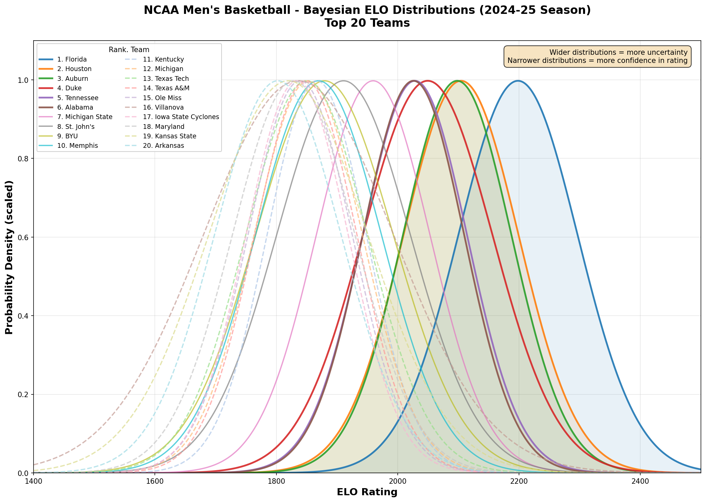

# NCAA-Bayes-ELO

A Bayesian ELO rating system for NCAA Men's Basketball that maintains full probability distributions over team strengths rather than point estimates.

## Current Rankings (2025-26 Season)



> **Auto-updated daily** via GitHub Actions. Rankings reflect games through the previous day.

The chart above shows the probability distributions for the top 20 teams. Key observations:
- **Duke** leads with mean ELO ~2100, followed by Iowa State and Michigan
- All distributions are relatively wide (StdDev 160-260) due to limited games played
- As the season progresses, distributions will narrow as more data becomes available

<details>
<summary>2024-25 Season (Archived)</summary>


End-of-season observations:
- **Florida** finished #1 with mean ELO ~2200 and a narrow distribution
- **Villanova** and **Kansas State** had wider distributions due to variable results
- Teams with narrower distributions (Tennessee, Alabama) showed more consistent performance
</details>

## Features

- **Bayesian ELO**: Maintains probability distributions over team ELO ratings, quantifying uncertainty
- **Optimized Parameters**: Uses K factor of 0.90, cross-validated on 2024 season data (see [ELO-Tuning-Go](https://github.com/corykiser/ELO-Tuning-Go))
- **Dual Data Sources**: Fetches game data from ESPN or NCAA.com APIs
- **Multiple Output Formats**: Table, JSON, or CSV output
- **Matchup Predictions**: Predict win probabilities for any two teams

## Quick Start

```bash
# Build
go build -o ncaa-bayes-elo

# Run with default settings (ESPN data, 2025 season, top 25)
./ncaa-bayes-elo

# Use NCAA.com data source
./ncaa-bayes-elo -source ncaa

# Show top 50 teams
./ncaa-bayes-elo -top 50

# Output as JSON
./ncaa-bayes-elo -format json -output rankings.json

# Output as CSV
./ncaa-bayes-elo -format csv -output rankings.csv

# Show all teams
./ncaa-bayes-elo -all

# Get detailed distribution for a specific team
./ncaa-bayes-elo -team "57"  # Team ID from ESPN

# Predict a matchup
./ncaa-bayes-elo -predict "57,150"  # Florida vs Duke
```

## Command Line Options

| Flag | Default | Description |
|------|---------|-------------|
| `-source` | `espn` | Data source: `espn` or `ncaa` |
| `-season` | `2025` | Season year (e.g., 2025 = 2024-25 season) |
| `-top` | `25` | Number of top teams to display |
| `-all` | `false` | Show all teams |
| `-format` | `table` | Output format: `table`, `json`, or `csv` |
| `-output` | stdout | Output file path |
| `-team` | | Show detailed distribution for team ID |
| `-predict` | | Predict matchup: `teamID1,teamID2` |
| `-no-cache` | `false` | Bypass cache and fetch fresh data |
| `-clear-cache` | `false` | Clear cached data before running |

## Sample Output

```
NCAA Men's Basketball Bayesian ELO Rankings (2025-2026 Season)
Generated: 2025-12-06 17:02:28
====================================================================================================
Rank Team                               Mean   StdDev     5th%    25th%   Median    75th%    95th%
----------------------------------------------------------------------------------------------------
1    Duke Blue Devils                 2099.2    183.7   1810.0   1970.0   2090.0   2220.0   2415.0
2    Iowa State Cyclones              2070.1    188.1   1775.0   1940.0   2065.0   2190.0   2390.0
3    Michigan Wolverines              2054.0    193.6   1745.0   1920.0   2050.0   2180.0   2380.0
4    Arizona Wildcats                 2018.8    197.1   1705.0   1885.0   2010.0   2145.0   2355.0
5    Gonzaga Bulldogs                 1971.9    169.6   1700.0   1855.0   1965.0   2085.0   2260.0
...
```

## Understanding the Output

- **Mean**: Expected ELO rating (higher = better)
- **StdDev**: Uncertainty in the rating (higher = less certain)
- **Percentiles**: Distribution of possible true ELO values
  - 5th%: Conservative lower bound
  - 95th%: Optimistic upper bound
  - 50% (Median): Most likely true rating

Teams with high StdDev have more uncertain ratings, often due to fewer games played or inconsistent results.

## Data Sources

### ESPN API (Default)
- Undocumented but reliable JSON API
- No authentication required
- Parallel fetching with 10 concurrent workers

### NCAA.com API
- Community wrapper by [henrygd](https://github.com/henrygd/ncaa-api)
- Covers all NCAA sports
- Parallel fetching with 5 concurrent workers (API rate limit)

### Caching
- Season data is cached locally after first fetch
- Completed seasons are cached indefinitely
- Current season cache expires daily (to pick up new games)
- Use `-no-cache` to force fresh data or `-clear-cache` to reset

## How It Works

### Bayesian ELO Algorithm

1. **Initialize**: Each team starts with a normal prior distribution (mean=1500, std=300)

2. **For each game**:
   - Compute joint distribution of both teams' ELOs
   - Calculate likelihood: `P(winner wins | ELO_diff) = 1 / (1 + 10^(-diff * K / 400))`
   - Multiply joint by likelihood and normalize
   - Marginalize to get updated distributions

3. **Output**: Full probability distributions showing uncertainty

### Why K = 0.90?

The K factor was optimized via cross-validation:
- **Training**: 2016-2019, 2022-2023 seasons
- **Testing**: 2024 season
- **Result**: K=0.90 achieves 90% better log loss than K=30.464

A lower K factor produces better-calibrated probabilities by avoiding overconfident predictions.

## Project Structure

```
ncaa-bayes-elo-go/
├── main.go           # CLI and output formatting
├── bayesian_elo.go   # Core Bayesian ELO algorithm
├── espn_client.go    # ESPN API client (with goroutines)
├── ncaa_client.go    # NCAA API client (with goroutines)
├── cache.go          # Local caching for season data
├── go.mod
└── README.md
```

## Related Projects

- [ELO-Tuning-Go](https://github.com/corykiser/ELO-Tuning-Go): Parameter optimization for this system

## License

MIT
